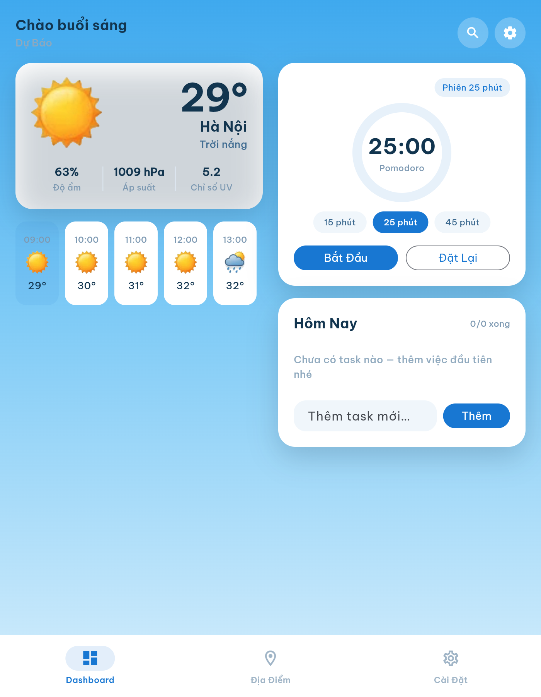
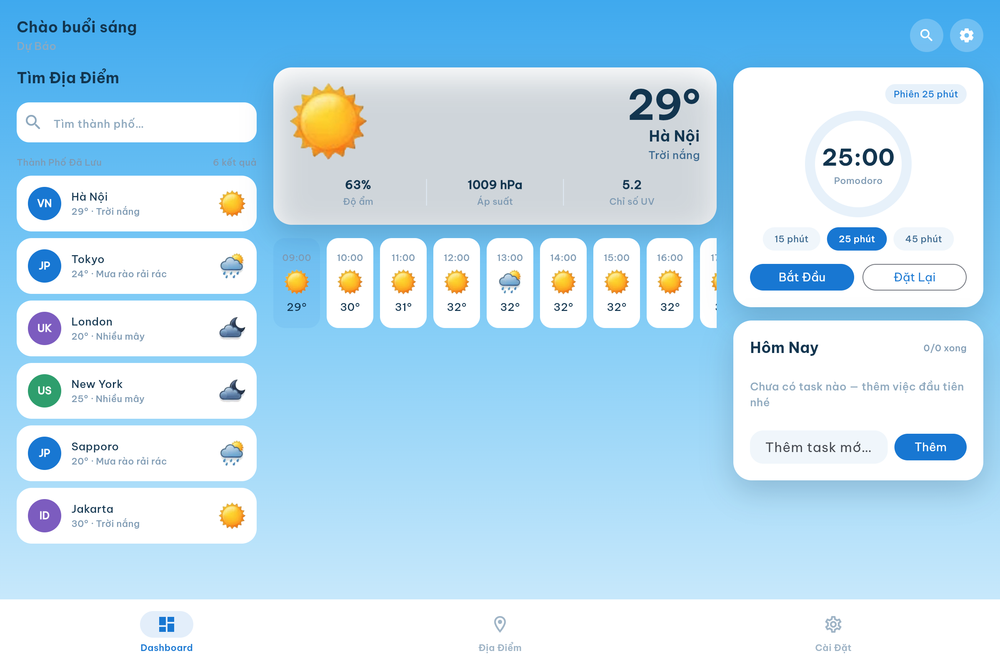
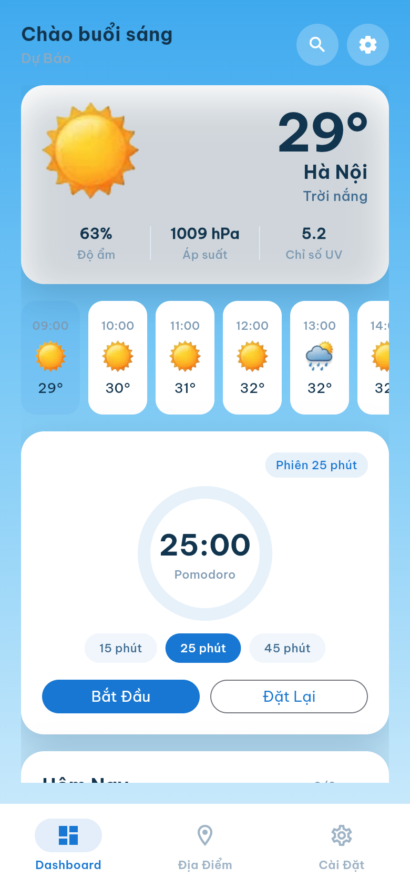

<div align="center">

# MeteoFocus

**Weather & Focus mini dashboard** — real-time weather combined with a Pomodoro timer and a daily to-do list, built with Flutter (Clean Architecture + Riverpod).

🇬🇧 [English](#english) · 🇻🇳 [Tiếng Việt](#tiếng-việt)

🌐 [Live demo](https://meteofocus.vercel.app) &nbsp;·&nbsp; 📦 [Source](https://github.com/trungthe-proposal/meteofocus/blob/master/README.md)  &nbsp;·&nbsp; 📄 [License](LICENSE)

</div>

---

## English

### Overview

MeteoFocus is a personal-productivity dashboard that pairs a real-time weather widget with a Pomodoro focus timer and a quick to-do list. It was built as a portfolio project to demonstrate a production-shaped Flutter codebase: Clean Architecture, Riverpod state management, a free (no-API-key) weather backend, adaptive layouts for phones/foldables/desktops, and i18n from day one.

### Features

- **Real-time weather** — current conditions, hourly strip, and a 10-day forecast, fetched via GPS or manual city search (Open-Meteo).
- **Instant load, no GPS blocking** — the dashboard shows a default city immediately while GPS resolves quietly in the background, then upgrades in place. The chosen/detected city is remembered for next launch.
- **Weather-reactive background** — the sky gradient smoothly transitions across 10 conditions (clear, cloudy, rain, storm, snow, fog, night, etc.).
- **Offline-aware cache** — a 15-minute Hive cache serves stale data with a visible badge when the network is down, instead of a blank error screen.
- **Focus Timer (Pomodoro)** — countdown ring with selectable duration (15/25/45 min), persisted across sessions.
- **To-Do list** — add, toggle, and persist daily tasks locally.
- **Settings that actually do something** — °C/°F unit conversion applies everywhere temperature is shown; Auto/Day/Night forces the sky theme regardless of the real time of day.
- **Fully responsive** — Compact (phone), Medium (foldables, hinge-aware two-pane layout), Expanded (tablet/desktop, three-pane layout), and a Cover Screen mode for tiny secondary displays.
- **i18n-ready** — Vietnamese by default, English included, driven by ARB files — no hardcoded UI strings.

### Screenshots

<table>
  <tr>
    <td align="center" width="45%">
      <br/>
      <sub><b>Medium</b> — foldable, 600–840dp, hinge-aware two-pane</sub>
    </td>
    <td align="center" width="55%">
      <br/>
      <sub><b>Expanded</b> — tablet/desktop, &gt;840dp, three-pane (Search · Weather · Focus)</sub>
    </td>
  </tr>
  <tr>
    <td align="center">
      <br/>
      <sub><b>Compact</b> — phone, &lt;600dp</sub>
    </td>
    <td align="center">
      <br/>
      <sub><b>Cover Screen</b> — tiny secondary display</sub>
    </td>
  </tr>
</table>

### Tech Stack & Architecture

Clean Architecture (`data` / `domain` / `presentation`) per feature module (`weather`, `location`, `focus`, `settings`), with Riverpod as the sole cross-layer wiring mechanism (no service locators, no `BuildContext`-based DI).

| Concern | Choice |
|---|---|
| State management | [`flutter_riverpod`](https://pub.dev/packages/flutter_riverpod) — `AsyncNotifier`/`Notifier`, provider overrides for async bootstrap deps |
| Routing | [`go_router`](https://pub.dev/packages/go_router) — `StatefulShellRoute` for the bottom nav, nested push route for Weather Detail |
| HTTP | [`dio`](https://pub.dev/packages/dio) |
| Weather data | [Open-Meteo](https://open-meteo.com/) (Forecast + Geocoding APIs) — chosen over OpenWeatherMap because it needs **no API key or credit card**, while still covering every field the design required (UV index, 16-day forecast, geocoding) |
| Local storage | [`hive`](https://pub.dev/packages/hive) (weather cache, to-do items) + [`shared_preferences`](https://pub.dev/packages/shared_preferences) (settings, last city, Pomodoro duration) |
| Location | [`geolocator`](https://pub.dev/packages/geolocator) |
| Fonts | [`google_fonts`](https://pub.dev/packages/google_fonts) (Be Vietnam Pro) |
| Animation | [`flutter_animate`](https://pub.dev/packages/flutter_animate) |
| i18n | Flutter's built-in ARB + `gen-l10n`, `intl` |

Full architecture notes (breakpoints, caching strategy, error handling, the Open-Meteo vs. OpenWeatherMap comparison, and a day-by-day build log) are documented separately during development — ask if you'd like them included here too.

### Getting Started

```bash
git clone https://github.com/trungthe-proposal/meteofocus.git
cd meteofocus
flutter pub get
flutter run -d chrome   # no API key needed — Open-Meteo is key-free
```

Run tests:

```bash
flutter test
```

Build for web:

```bash
flutter build web --release
```

### Project Structure

```text
lib/
├── app/            # Theme, router, breakpoints
├── core/           # Network client, cache, error types, prefs
├── features/
│   ├── weather/    # Current/hourly/forecast — data, domain, presentation
│   ├── location/   # GPS + city search (Open-Meteo Geocoding)
│   ├── focus/      # Pomodoro + To-Do
│   └── settings/   # Units, theme, preferences
├── l10n/           # ARB files (vi default, en included)
├── shared/         # Cross-feature widgets
└── main.dart
```

### License

Code: [MIT](LICENSE). Assets (AI-generated weather icons, app icons, font, Open-Meteo data) carry their own attribution — see the notes at the bottom of the `LICENSE` file.

---

## Tiếng Việt

### Tổng quan

MeteoFocus là dashboard năng suất cá nhân kết hợp widget thời tiết thời gian thực với đồng hồ tập trung Pomodoro và danh sách việc cần làm. Đây là dự án portfolio nhằm thể hiện một codebase Flutter đúng chuẩn sản xuất: Clean Architecture, quản lý state bằng Riverpod, nguồn dữ liệu thời tiết miễn phí (không cần API key), layout thích ứng cho điện thoại/máy gập/desktop, và i18n ngay từ đầu.

### Tính năng

- **Thời tiết thời gian thực** — điều kiện hiện tại, dải giờ tới, dự báo 10 ngày, lấy qua GPS hoặc tìm thành phố thủ công (Open-Meteo).
- **Hiện dữ liệu ngay, không chờ GPS** — Dashboard hiện thành phố mặc định ngay lập tức trong khi GPS phân giải ngầm phía sau rồi cập nhật tại chỗ. Thành phố đã chọn/đã dò được nhớ lại cho lần mở sau.
- **Nền trời đổi theo thời tiết** — sky-gradient chuyển mượt qua 10 điều kiện (nắng, nhiều mây, mưa, dông, tuyết, sương mù, đêm...).
- **Cache có ý thức về mất mạng** — cache Hive 15 phút, hiện dữ liệu cũ kèm badge khi mất mạng thay vì màn hình lỗi trắng.
- **Focus Timer (Pomodoro)** — vòng tròn đếm ngược, chọn được thời lượng (15/25/45 phút), nhớ lựa chọn qua các lần mở app.
- **To-Do** — thêm, đánh dấu hoàn thành, lưu lại việc cần làm hằng ngày.
- **Settings đổi thật, không chỉ để trưng** — đổi đơn vị °C/°F áp dụng ở mọi nơi hiện nhiệt độ; Auto/Sáng/Tối ép giao diện trời bất kể giờ thực tế.
- **Responsive đầy đủ** — Compact (điện thoại), Medium (máy gập, né bản lề thật), Expanded (tablet/desktop, layout 3 cột), và chế độ Cover Screen cho màn phụ siêu nhỏ.
- **Sẵn sàng đa ngôn ngữ** — tiếng Việt mặc định, có sẵn tiếng Anh, toàn bộ qua file ARB — không hardcode string.

### Ảnh chụp màn hình

Xem bảng ảnh 4 breakpoint ở mục **Screenshots** phần tiếng Anh phía trên (giống nhau, không lặp lại).

### Công nghệ & Kiến trúc

Clean Architecture (`data` / `domain` / `presentation`) theo từng feature module (`weather`, `location`, `focus`, `settings`), Riverpod là cơ chế kết nối xuyên layer duy nhất.

Xem bảng công nghệ chi tiết ở mục **Tech Stack & Architecture** phần tiếng Anh phía trên — điểm đáng chú ý nhất: chọn **Open-Meteo** thay vì OpenWeatherMap vì không cần API key/thẻ tín dụng, vẫn đủ field thiết kế cần (UV index, dự báo 16 ngày, geocoding).

### Bắt đầu

```bash
git clone https://github.com/trungthe-proposal/meteofocus.git
cd meteofocus
flutter pub get
flutter run -d chrome   # không cần API key — Open-Meteo miễn phí không key
```

Chạy test:

```bash
flutter test
```

Build web:

```bash
flutter build web --release
```

### Cấu trúc thư mục

Xem cây thư mục ở mục tiếng Anh phía trên (giống nhau, không lặp lại).

### License

Code: [MIT](LICENSE). Asset (icon thời tiết AI-generated, app icon, font, dữ liệu Open-Meteo) có ghi chú nguồn/license riêng ở cuối file `LICENSE`.
